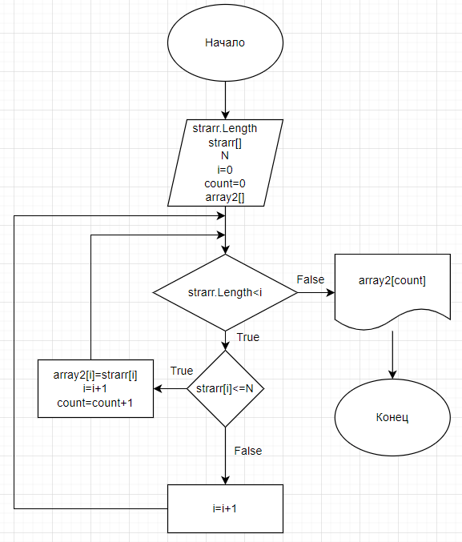

# **Итоговая проверочная работа**
## **Задание:**
 Написать программу, которая из имеющегося массива строк формирует новый массив из строк, длина которых меньше, либо равна 3 символам. Первоначальный массив можно ввести с клавиатуры, либо задать на старте выполнения алгоритма. При решении не рекомендуется пользоваться коллекциями, лучше обойтись исключительно массивами.
 ## **Алгоритм решения:**
 1. Пользователь задает с клавиатуры массив из строк (strarr). Сначала вводится количество строк, после чего вводятся элементы массива через ENTER.
 2. Выводим получившийся массив 1. 
 3. Пользователь вводит с клавиатуры максимальное число символов в элементе массива (N).
 3. Отбираем из массива те элементы которые меньше или равны N. В рамках нашей задачи N=3. Для этого вводим переменную-счетчик и задаём новый массив, куда будет саписываться результат(array2). После чего проходимся циклом по массиву, который был введен с клавиатуры. Цикл поочерёдно перебирает элементы массива и сравнивает длину каждого элемента с N. Если длина элемента миссива меньше или равна N то данный элемент будет записан в новый массив(array2), а счетчик увеличится на 1. Новый массив задается с длиной равной счетчику.
 4. Выводим получившийся массив 2(array 2).
## Дополнительные материалы
1. Блок схема метода представлена в файле SchemeStringArrayByN и представлена ниже.

2. Реализация алгоритма представлена в файле Program.cs